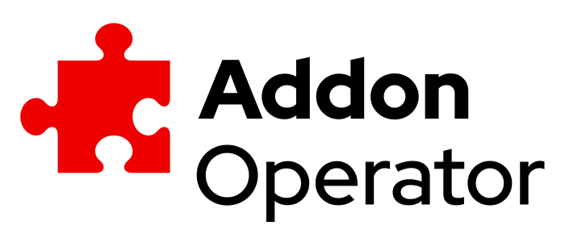

# Addon Operator

<p align="center">
	
</p>

<p align="center">
	
	
	
</p>

---

Addon Operator coordinates the lifecycle of Addons in managed OpenShift.

---

## Development

All development tooling can be accessed via `make`, use `make help` to get an overview of all supported targets.

This development tooling is currently used on Linux amd64, please get in touch if you need help developing from another Operating system or architecture.

### Prerequisites and Dependencies

To contribute new features or test `podman` or `docker` and the `go` tool chain need to be present on the system.

Dependencies are loaded as required and are kept local to the project in the `.cache` directory and you can setup or update all dependencies via `make dependencies`

Updating dependency versions at the top of the `Makefile` will automatically update the dependencies when they are required.

If both `docker` and `podman` are present you can explicitly force the container runtime by setting `CONTAINER_RUNTIME`.

e.g.:
```
CONTAINER_RUNTIME=docker make dev-setup
```

### Committing

Before making your first commit, please consider installing [pre-commit](https://pre-commit.com/) and run `pre-commit install` in the project directory.

Pre-commit is running some basic checks for every commit and makes our code reviews easier and prevents wasting CI resources.

### New Features

### New Tests
