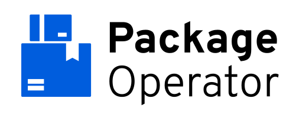

# Package Operator

	

	
	
	
	

---

Package Operator is an open source operator for [Kubernetes](https://kubernetes.io/), managing packages as collections of arbitrary objects, to install and maintain applications on one or multiple clusters.

---

- [Project Status](#project-status)
- [Features](#features)
- [Documentation](#documentation)
- [Contributing](#contributing)
- [Development](#development)

---

## Project Status

Package Operator is currently in early development and neither complete nor ready for production use.
APIs are not yet final and breaking changes might be introduced in every release.

## Features

- No Surprises
	- Ordered Installation and Removal
	- Operating Transparency
- Extensible
	- Declarative APIs
	- Plug and Play
- Cheap Failures and Easy Recovery
	- Rollout History
	- Rollback

## Documentation

Package Operator documentation is available on [package-operator.run](https://package-operator.run).

The source of this website is our [website repository](https://github.com/package-operator/package-operator.github.io) which is hosted via Github Pages, [Hugo](https://gohugo.io/) and using the [Doks template](https://getdoks.org/).

## Contributing

Thank you for taking time to help to improve Package Operator!

Feel free to open issues or propose pull requests, but please keep in mind that Package Operator is still in early development and response times for accessing contributions may vary.

We also are not yet ready to open project management and meetings to the general public.

## Development

The Package Operator project keeps almost all dependencies confined to the project checkout directory and manages dependencies within the project itself.

To get started hacking, you just need Go 1.18+ and podman or docker installed.

### Commands and local development

> **Dev Note**
> Assure you have `export CONTAINER_RUNTIME=docker` or similar for `podman`, or you will get cryptic errors from mage that may lead you to think there is a problem with the kind cluster.

Package Operator uses [Mage](https://magefile.org/) (Think make, but all targets are written in Go instead of Shell) as task manager and developer command interface.

| Command | Description |
| ------- | ----------- |
| `./mage -l` | List all available commands. |
| `./mage dev:deploy` | Creates a new cluster via kind and deploys PKO on it. |
| `./mage dev:integration` | Creates a new cluster via kind and deploys PKO on it and runs the integration test suite. |
| `./mage dev:teardown` | Tears down the local development cluster. |
| `./mage dependency:all` | Installs all project dependencies into the local checkout. |
