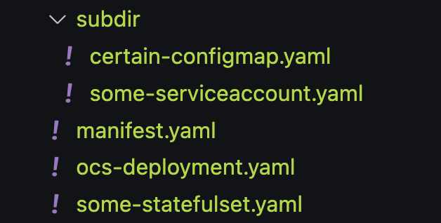

## Package-Loader

package-loader is a minimalistic CLI tool meant to take a Package's bundles as an input and load (upsert) the corresponding
desired `ObjectDeployment` into the respective Kubernetes cluster.

## Installation

### Building the package-loader binary

* Clone this repository
* Run the following command:
```sh
./mage build:binary package-loader
```

This will save the package-loader binary at `./bin/$(go env GOOS)_$(go env GOARCH)/package-loader`.

Meaning, if you run the above `mage` command on a `linux/amd64` machine, the package-loader binary will end up at
`./bin/linux_amd64/package-loader` (GOOS: linux, GOARCH: amd64)

### Building the docker image

* Run the following command to build the image serving the functionality of package-loader:
```sh
./mage build:image package-loader
```

The logs from the above command would share the image link of the above image.

That image would have package-loader binary at its ENTRYPOINT, so you can use it exactly how one would use the native binary of the package-loader.

## Pre-requisites

package-loader expects the package bundles in a certain format.

Package-bundles are manifests representing the workloads of a package such as the core manifests, phases and probes.

Package-bundles are supposed to be organized in the following format:



* the `manifest.yaml` file is supposed to contain the details about the `availabilityProbes` supposed to end up in the final `ObjectDeployment`
* all the other YAML files would represent the objects which would go under the package-bundles directory.
* To denote, which object goes under which phase, the `package-operator.run/phase` annotation is provided under that resource's YAML file.

For example, say, the following `manifest.yaml` is present in the package-bundles directory

```yaml
apiVersion: manifests.package-operator.run/v1alpha1
kind: PackageManifest
spec:
  phases:
  - name: pre-requisites
  - name: main-stuff
  availabilityProbes:
  - probes:
    - condition:
        type: Available
        status: "True"
    - fieldsEqual:
        fieldA: .status.updatedReplicas
        fieldB: .status.replicas
    selector:
      kind:
        group: apps
        kind: Deployment
```

This shows that the ObjectDeployment formed by the package-loader would contain the following availabilityProbes:
```yaml
availabilityProbes:
- probes:
- condition:
  type: Available
  status: "True"
- fieldsEqual:
  fieldA: .status.updatedReplicas
  fieldB: .status.replicas
selector:
  kind:
  group: apps
  kind: Deployment
```
and that ObjectDeployment would have two phases (in the same order)
* main-stuff
* pre-requisites

And say, following file is present anywhere in the package-bundles directory:
```yaml
apiVersion: v1
kind: ServiceAccount
metadata:
  name: some-service-account
  annotations:
    package-operator.run/phase: "pre-requisites"
```
This would tell the package-loader to feed the above ServiceAccount under the `pre-requisites` phase in the final ObjectDeployment.

## Package-loader arguments

Package-loader being a CLI tool expects a set of arguments to run properly

| argument          | value type | default value | explanation                                            |
|-------------------|------------|---------------|--------------------------------------------------------|
| `-package-name`      | string     | ""            | Name of the package                                    |
| `-package-namespace` | string     | ""            | Target namespace associated with the package           |
| `-package-dir`       | string     | ""            | Path to the directory containing the package's bundles |
| `-ensure-namespace`             | bool       | false         | Create packageNamespace if it doesn't exist. Only works with 'namespace' scope               |
| `-scope`             | string       | ""         | Scope of the ObjectDeployment to be created. 'cluster' creates ClusterObjectDeployment, 'namespace' creates ObjectDeployment               |
| `-labels`             | string       | ""         | Comma-separated list of labels to be propagated to the ObjectDeployment/ClusterObjectDeployment's child ObjectSets. For example, 'key=value,foo=bar'               |
| `-debug`             | bool       | false         | Toggle debug logs for the package-loader               |

## How to run

* Ensure that the current context of your local kubeconfig points to the cluster where you want to load Package.

* Assuming the `package-loader` to be accessible on your `PATH`, a command like this:

```sh
package-loader -package-name foo -package-namespace foo-ns -package-dir /path/to/package-bundles -scope namespace -labels app=nginx
```

This would do the following:
* Parse the contents from the `/path/to/package-bundles`
    * Pre-requisites: `/path/to/package-bundles/manifest.yaml` must be present complying with the `PackageManifest` type in `apis/manifests/v1alpha1/packagemanifest_types.go`
    * The expected objects should have the annotation `package-operator.run/phase: "phase-name"` denoting the phase those objects intend to be allocated to.
* Use the above contents to render an `ObjectDeployment` / `ClusterObjectDeployment` for the package name `foo` and deploy/apply it in the namespace `foo-ns`
```yaml
apiVersion: ...
kind: ObjectDeployment
metadata:
  name: <packageName>
  namespace: <packageNamespace>
spec:
  metadata:
    matchLabels:
      app: nginx
  template:
    metadata:
      app: nginx
    spec: ... <object set spec>
```
